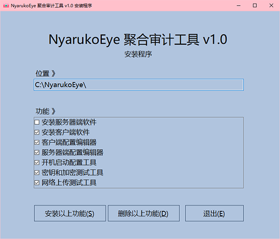
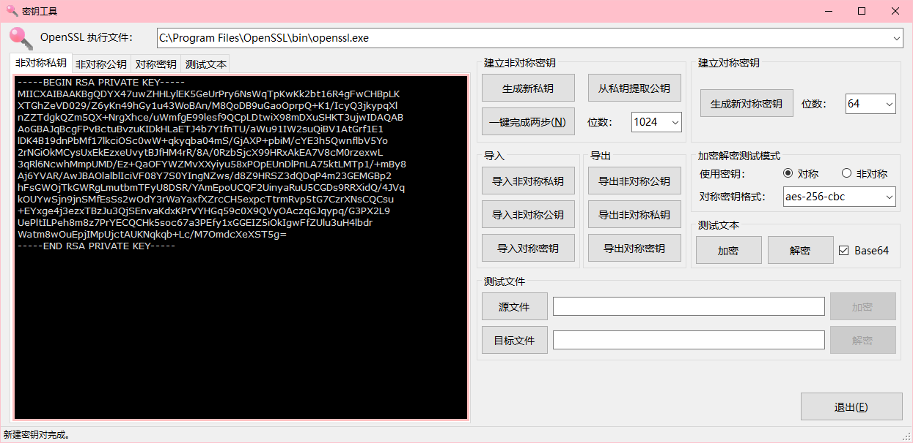
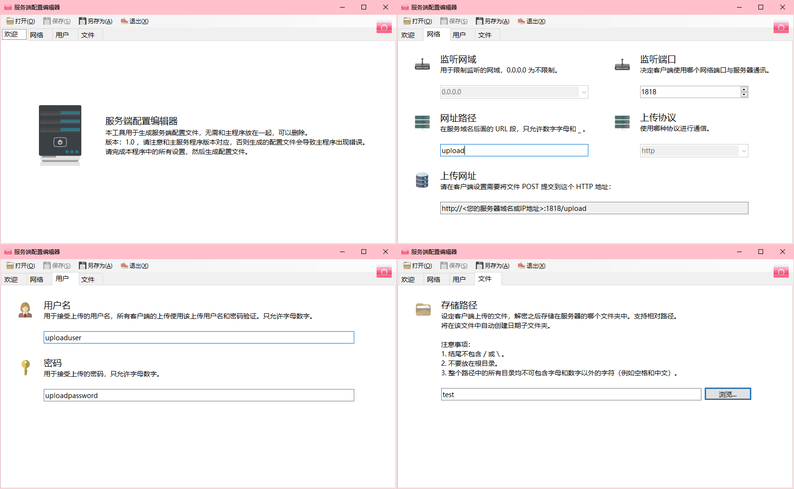
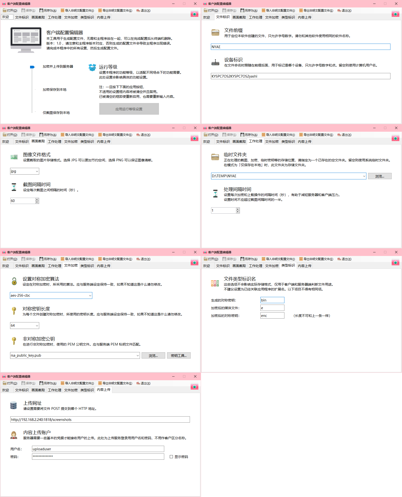
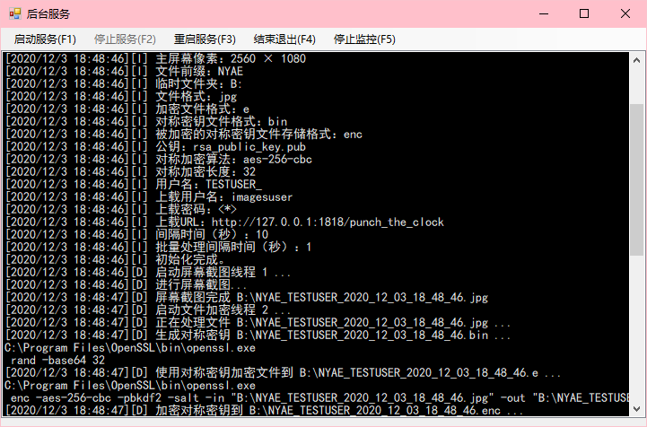
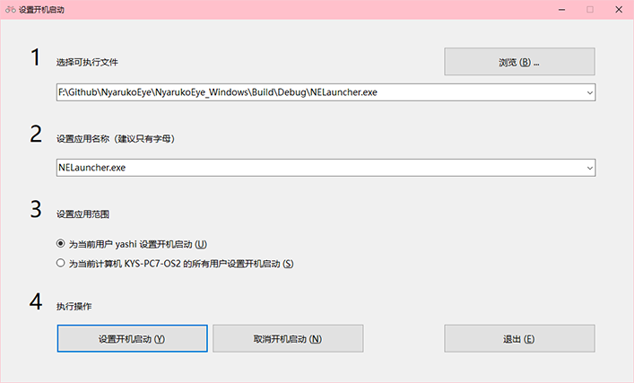

# NyarukoEye 聚合审计

一款用于 Windows 平台的定时截图并上传到统一服务器的工具。用于：

- 监控自己的 Windows 服务器远程桌面被别人非法登录时进行的操作。
- 监控个人计算机被他人非法使用时进行的操作。
- 统一监控和记录自己的多台电脑或服务器等正在运行的工作任务的进展。

等等合法用途，[请不要将该程序用于非法用途](#警告请勿将本软件用于非法的监控用途)。

## 功能

- 客户端
  - 每隔一段时间（时长可设置）对主屏幕进行截图（格式可设置）
  - 进行非对称加密（即使客户端自己也无法解密）
  - 上传到服务器端（支持缓存，也可仅保存在本机）
  - 在后台隐藏（可通过配置文件和快捷键呼出后台控制面板）
- 服务端
  - 接收上传的加密文件并进行解密
  - 按日期和 IP 地址进行文件夹归档，保存这些截图文件。
- 配置工具
  - 包含多个配置实用程序，请参阅文件功能说明。

```text
｜－－－－－－－－网－－－－－－－－－｜
｜　　客户端　　　｜　　　服务器端　　｜
｜－－－－－－－－络－－－－－－－－－｜
　截屏　->　加密　\
　截屏　->　加密　->　解密　->　保存
　截屏　->　加密　/
｜－－－－－－－－｜－－－－－－－－－｜
```

## 目录

- [一、安装](#一安装)
  - [系统要求](#系统要求)
  - [准备环境](#准备环境)
  - [安装功能](#安装功能)
  - [有关反病毒软件的注意事项](有关反病毒软件的注意事项)
- [二、文件功能](#二文件功能)
  - [可执行文件](#可执行文件)
  - [库文件](#库文件)
  - [配置文件](#配置文件)
- [三、创建密钥对](#三创建密钥对)
  - [使用密钥工具生成RSA密钥对](#使用密钥工具生成rsa密钥对)
- [四、配置服务端](#四配置服务端)
  - [上传文件](#上传文件)
  - [创建配置文件](#创建配置文件)
  - [运行服务端](#运行服务端)
- [五、配置客户端](#五配置客户端)
  - [安装客户端](#安装客户端)
  - [创建客户端配置文件](#创建客户端配置文件)
  - [创建客户端运行器配置文件](#创建客户端运行器配置文件)
  - [测试运行客户端](#测试运行客户端)
- [六、隐藏运行](#六隐藏运行)
- [七、设置开机启动](#七设置开机启动)
  - [Windows中设置开机启动](#windows中设置开机启动)
- [八、卸载](#八卸载)
  - [卸载客户端](#卸载客户端)
  - [卸载服务端](#卸载服务端)
- [九、从源码编译](#九从源码编译)
- [十、许可协议](#十许可协议)
  - [警告：请勿将本软件用于非法的监控用途！](#警告请勿将本软件用于非法的监控用途)

# 一、安装

## 系统要求

- 客户端
  - `Windows 7` - `Windows 11`
  - 32 位或 64 位 x86 处理器
  - 已安装 `.NET Framework 4.8.1` 运行库
  - 已安装 `OpenSSL` 命令
- 服务器端
  - `Windows 7` - `Windows 11`
  - `Windows Server 2008 R2` - `Windows Server 2019`
  - `CentOS / RHEL 7 - 8`

## 准备环境

下载运行库

1. `.NET Framework 4.8.1`
    - 如果客户端电脑尚未安装 `.NET Framework 4.8.1` ，请先 [下载](https://www.microsoft.com/zh-cn/download/details.aspx?id=17718) 安装。
2. `OpenSSL`
    - 客户端和服务器均需要安装 `OpenSSL` ，如果没有该命令，请先进行安装。
    - 对于 Linux 系统，通常该命令已经包含。
    - 对于 Windows 系统，可以使用以下方式之一进行安装：
        - [下载第三方打包好的安装程序](http://slproweb.com/products/Win32OpenSSL.html) 进行安装。
        - 使用 `Chocolatey` 软件包管理器进行安装： `choco install openssl -y` 。
        - 将 `openssl.exe` 直接拷贝到本程序安装目录中。

## 安装功能

1. 下载安装程序
    - 您可以从源代码编译安装，也可以通过安装程序安装。
    - 要从安装程序安装，请转到 [Release](releases) 页面下载该安装程序，并进行本节接下来的步骤。
    - 要从源代码编译，请转到 [编译](#九从源码编译) 节。
2. 启动安装包 `NyarukoEye_Install.EXE` 。
    - 
3. 点击 `位置` 输入框，选择要安装的文件夹。
    - 请勿安装在系统文件夹、其他用户目录、驱动器根目录。
    - 文件夹路径**只允许使用英文字母和数字**，不允许有空格、符号、中文等其他字符。
    - 请选择一个空白文件夹，或者在选择创建文件夹时新建文件夹。
4. 在 `功能` 框双击选择需要安装的组件（具体组件请见 [文件功能](#二文件功能)），提示完成后， `退出` 即可。

## 有关反病毒软件的注意事项

由于本程序的功能，可能会被杀毒软件的主动分析功能检测为木马，为了防止这一情况发生，推荐进行以下配置：

1. 在安装之前退出杀毒软件。
2. 安装完成后，将 `安装文件夹` 或 `NELauncher.exe` `scrchk.exe` 两个文件添加到杀毒软件的白名单，再启动杀毒软件。

# 二、文件功能

## 可执行文件

安装程序会释放以下文件，以下是这些文件的功能。关于具体的使用方法在之后会介绍。

| 文件名                   | 功能组 | 界面 | 简要描述 |
| ------------------------ | ------ | --- | -------- |
| `nyarukoeyesev.exe`      | 服务端 | CUI | 服务器端软件 |
| `NELauncher.exe`         | 客户端 | GUI | 客户端软件启动和管理器 |
| `scrchk.exe`             | 客户端 | CUI | 客户端软件后台主程序 |
| `ConfigEditer.exe`       | 工具箱 | GUI | 客户端配置文件编辑器 |
| `ConfigEditerServer.exe` | 工具箱 | GUI | 服务端配置文件编辑器 |
| `KeyTool.exe`            | 工具箱 | GUI | 密钥和加密测试工具 |
| `NetTool.exe`            | 工具箱 | GUI | 网络上传测试工具 |
| `Autorun.exe`            | 工具箱 | GUI | 开机启动配置工具 |

## 库文件

如果安装项目包括客户端或者工具箱功能组中的文件，安装程序还会安装以下库文件。

| 文件名          | 功能组   | 简要描述 |
| --------------- | -------- | -------- |
| `Enc.dll`       | 组件库   | 加密模块 |
| `INI.dll`       | 组件库   | 配置文件模块 |
| `NetUL.dll`     | 组件库   | 网络模块 |
| `Shot.dll`      | 组件库   | 截图模块 |
| `RestSharp.dll` | 第三方库 | 网络模块 |

## 配置文件

- 以下文件由使用者来创建，用于确定程序如何进行工作。
- 这些文件应放在所属功能组同一个安装目录下面。
- 可以手动书写这些配置文件，也可用下表`生成工具`来生成或编辑。
- 文件的生成方式会在之后的内容中介绍。

| 文件名                  | 必须 | 功能组 | 生成工具                 | 简要描述 |
| ----------------------  | ---- | ------ | ------------------------ | -------- |
| `rsa_private_key.pem`   | 是 | 服务端 | `KeyTool.exe`            | 服务端加密私钥 |
| `rsa_server_conf.json`  | 是 | 服务端 | `ConfigEditerServer.exe` | 服务端配置文件 |
| `rsa_public_key.pub`    | 是 | 客户端 | `KeyTool.exe`            | 客户端加密私钥 |
| `NyarukoEye.ini / .ine` | 是 | 客户端 | `ConfigEditer.exe`       | 客户端配置/加密配置文件 |
| `NELauncher.cfg`        | 否 | 客户端 | -                        | 客户端启动器配置 |

# 三、创建密钥对

- 为了保护本地缓存的文件和传输过程中的隐私安全，加密功能需要一个 [RSA 密钥对](https://baike.baidu.com/item/RSA%E7%AE%97%E6%B3%95) 才能工作。
  - 公钥（ `rsa_public_key.pub` ）储存在客户端安装目录中，只能用于进行加密，因此即使客户端自己也无法进行解密。
  - 私钥（ `rsa_private_key.pem` ）存储在服务端安装目录中，请注意保管它，它可以解密客户端加密的内容。
- 使用 `OpenSSL` 手工生成它们，也可用本软件包中的 `KeyTool.exe` 生成它们。

## 使用密钥工具生成RSA密钥对

1. 启动 `KeyTool.exe` 。


2. 选择 `建立非对称密钥` 的 `位数`。
    - 位数越高，加密安全等级越高，但对客户端和服务端的负载也会相应增加。
3. 点击 `生成新私钥` 。
4. 点击 `从私钥提取公钥` 。
5. 点击 `导出非对称公钥` 。
    - 文件名可以自由设置，在客户端配置文件中匹配该文件名即可。
    - 该文件应存储在客户端的安装文件夹。
6. 点击 `导出非对称私钥` 。
    - 文件名必须为 `rsa_private_key.pem` 。
    - 该文件应上传到服务端的安装文件夹。

# 四、配置服务端

## 上传文件

- Windows
  - 上传服务器端（两种方式）：
    - 上传安装程序，选中 `安装服务器端软件` 和 `开机启动配置工具` 进行安装。
    - 将 `nyarukoeyesev.exe` 上传到服务器中。
  - 通过计划任务或者本软件包中的 `Autorun.exe` 设置开机启动。
- Linux
  - 将 nyarukoeyesev 上传到服务器中。
  - 设置运行权限 `chmod +x nyarukoeyesev`
  - 通过 crontab 或 systemctl 创建开启启动项。

## 创建配置文件

- 必须有配置文件 `rsa_server_conf.json` 才能使服务器端正常运行。
- 该配置文件中的项目（所有键值皆为字符串）：

| 条目               | 示例内容             | 简要描述 |
| ---------------- | ---------------- | -------- |
| `handlepath`     | `imageuploadapi` | 网址路径 |
| `listenandserve` | `8080`           | 监听端口 |
| `filepath`       | `E:\\screen`     | 截图文件存储路径 |
| `uname`          | `uploaduser`     | 上传用用户名 |
| `password`       | `uploadpassword` | 上传用密码 |

- 您可以使用配置文件编辑器 `ConfigEditerServer.exe` 来创建此文件，而无需手工编写该配置文件。
- 有关每个设定值的详细要求也可参考下面配置编辑器的截图：



1. 仔细阅读每一项的注意事项并正确填写。
2. 点击 `另存为` ，文件名设置为 `rsa_server_conf.json` 。
3. 将上面生成的配置文件与执行文件 `nyarukoeyesev` (Linux) 或 `nyarukoeyesev.exe` (Windows) 放在同一个目录中。

## 运行服务端

在第一次设置完成后，应该手动运行一次，查看

1. 直接启动 `nyarukoeyesev` (Linux) 或 `nyarukoeyesev.exe` (Windows) 即可。
2. 出现 `监听端口` 的提示表示服务器已经启动成功。

# 五、配置客户端

## 安装客户端

参考上述 [安装步骤](#一安装) ，安装以下组件：

- 安装客户端软件
- 开机启动配置工具
- 客户端配置编辑器
  - 如果在其他机器上已经做好配置文件，则不用安装此项，也可以跳过下面的配置文件过程。

## 创建客户端配置文件

- 客户端程序在运行之后，会自动搜索配置文件：
    1. 尝试在自己的安装目录搜索加密配置文件 `*.ine` ，并加载找到的第一个文件。
    2. 尝试在自己的安装目录搜索普通配置文件 `*.ini` ，并加载找到的第一个文件。
- 因此，建议在客户端安装目录中仅存在一个 `.ine` 文件或 `.ini` 文件。
- 该配置文件中的项目（所有键值皆为字符串）：

| 条目          | 示例内容                 | 简要描述 |
| ----------- | -------------------- | -------- |
| `[User]`    | -                    | - |
| `Username`  | `uploaduser`         | 上传用用户名 |
| `Password`  | `uploadpassword`     | 上传用密码 |
| `Prefix`    | `NYAE`               | 文件前缀，用于定位本软件创建的文件 |
| `Name`      | `TESTUSER`           | 设备名称，用于标记是哪个设备 |
| `[Work]`    | -                    | - |
| `TempDir`   | `C:\Temp`            | 临时文件夹，留空用系统默认 |
| `Sleep`     | `10`                 | 截图间隔时间 |
| `WorkSleep` | `1`                  | 批量处理间隔时间 |
| `[File]`    | -                    | - |
| `Type`      | `jpg`                | 设置截图存储格式 |
| `KeyType`   | `bin`                | 对称密钥文件存储扩展名 |
| `EncType`   | `e`                  | 加密截图文件存储扩展名 |
| `EncKeyType`| `enc`                | 被加密的对称密钥文件存储扩展名 |
| `[Encrypt]` | -                    | - |
| `Symmetric` | `aes-256-cbc`        | 对称加密所用算法 |
| `AESLength` | `32`                 | 对称密钥长度 |
| `PublicKey` | `rsa_public_key.pub` | 非对称加密公钥文件路径 |
| `[Network]` | -                    | - |
| `UploadURL` | `http://127.0.0.1:8080/imageuploadapi` | 非对称加密公钥文件路径 |

- 您可以使用配置文件编辑器 `ConfigEditer.exe` 来创建此文件，而无需手工编写该配置文件。
- 有关每个设定值的详细要求也可参考下面配置编辑器的截图：



1. 仔细阅读每一项的注意事项并正确填写。
2. 点击 `另存为` ，保存为任意只有英文数字的文件名。
3. 你可以将该配置文件使用非明文，这样可以不会被客户端文本阅读软件直接打开。
    - 如果需要保存为非明文配置文件：
        - 点击 `导出非明文配置文件` ，保存为任意只有英文数字的文件名。
        - 将导出的 `.ine` 文件复制到客户端安装目录中。
    - 如果需要直接保存明文配置文件：
        - 将保存的 `.ini` 文件复制到客户端安装目录中。

## 创建客户端运行器配置文件

- 这是一个可选步骤，可用来修改和调试客户端程序的运行状态。
- 在可见的运行窗口中，可以方便地观察后台程序的运行状态和启动或安全停止它。
- 如果没有该配置文件，则启动器拉起后台程序后会直接退出，保留后台程序在后台持续运行，后台程序则只能通过强行结束来退出。
- 客户端运行器配置文件创建步骤：

1. 在客户端安装文件夹，新建一个文本文档，命名为 `NELauncher.cfg` 。
2. 文件内容只有一个数字：

| 文件内容 | 功能 |
| -------- | ---- |
| 0        | 不显示运行窗口，拉起后台程序后启动器直接退出不管 |
| 1        | 按 `Ctrl+Alt+Shift+F11` 显示运行窗口 |
| 2        | 始终显示运行窗口 |



## 测试运行客户端

可以用以下两种方式测试运行：

1. 通过启动器启动
    1. [创建客户端运行器配置文件](#创建客户端运行器配置文件)，配置为 `1` 或者 `2`。
    2. 运行启动器程序 `NELauncher.exe` ，显示状态窗口，查看状态是否正常。
2. 直接启动后台程序
    1. 运行后台程序 `scrchk.exe` ，直接在命令提示符显示状态，查看状态是否正常。

- 如果输出显示不正常，请同时检查服务器端的输出，确定错误的原因。
- 如果无法呼出窗口，可以去任务管理器检查进程是否在运行。

# 六、隐藏运行

- 要让客户端后台程序隐藏运行，可以 [创建客户端运行器配置文件](#创建客户端运行器配置文件)，配置为 `0` 或者 `1`，也可以不创建，则为默认的 `0` 。
- 客户端目录中的以下文件可以修改为其他名称：
  - `NyarukoEye.ini`
  - `NyarukoEye.ine`
  - `NELauncher.exe` （注意先清除开机启动再改名）
  - `rsa_public_key.pub` （注意修改配置文件）
  - 如果使用自定义的方式直接启动后台程序（不用 `NELauncher.exe` 启动），则 `scrchk.exe` 也可以修改。
- 在客户端目录中，所有 [功能组为工具箱的 exe 文件](#可执行文件) 都可以在配置好以后进行删除。

# 七、设置开机启动

在设置开机启动之前，请先测试程序工作是正常的。

## Windows中设置开机启动

- 可以使用系统内置的计划任务等功能实现开机启动，并自定义运行方式。
- 也可以使用本软件包中提供的工具 `Autorun.exe` 设置开机启动：



1. 选择要开机执行的可执行文件
    - 客户端： `NELauncher.exe`
    - 服务端： `nyarukoeyesev.exe`
2. 设置应用名称
    - 可以设置为任意英文字母。
    - 在取消开机启动时，需要用这个名字来进行移除。
3. 设置开机启动范围
    - 可以设置为只有当前用户登录时启动，还是所有用户登录时都会启动。
4. 设置或取消开机启动即可。
5. 退出。

# 八、卸载

## 卸载客户端

1. 在 [七、设置开机启动](#七设置开机启动) 步骤中，取消开机启动。
2. 前往 `任务管理器` ，终止所有本软件包相关进程。
3. 进行功能删除
    - 移除部分功能：
        - 在 [一、安装](#一安装) 的安装步骤中，选择要移除的功能，点 `删除以上功能` 。
    - 移除全部功能：
        - 直接删除安装目录。

## 卸载服务端

1. 删除开机启动。
2. 结束服务端进程 `nyarukoeyesev` 。
3. 直接删除即可。

# 九、从源码编译

01. 安装 `Microsoft Visual Studio 2019`，安装工作负载 `.NET 桌面开发`
02. 打开解决方案文件 `NyarukoEye_Windows\NyarukoEye_Windows.sln`
03. 下载所需 NuGet 包
04. 选择解决方案配置： `Release`
05. 选择菜单 `生成` -> `生成解决方案`
06. 退出 Visual Studio 。
07. 安装和配置 Golang 运行环境
08. 进入文件夹 `NyarukoEye_Server`
09. 运行 `build.bat`
10. 进入文件夹 `NyarukoEye_Windows`
11. 运行 `CopyReleaseEXE.bat`
12. 进入文件夹 `NyarukoEye_Windows\Build\Release`
13. 可以看到所有编译完毕的文件

# 十、许可协议

- `NyarukoEye` 软件根据[《木兰宽松许可证， 第2版》](http://license.coscl.org.cn/MulanPSL2) 获得许可。
- 您可以根据[《木兰宽松许可证， 第2版》的条款和条件](LICENSE) 使用本软件。

## 警告：请勿将本软件用于非法的监控用途

- **未授权的监控行为并非本软件的设计目的，并且违反了该软件的设计初衷。**
- **对合法软件的滥用行为作者不承担任何责任！用于非法用途会导致您承担法律责任！**
- **在 下载、使用、编辑、分享、部署 本软件 或 本软件的源代码 之前，您必须保证您将其用于合法用途！**

### LICENSE: 《木兰宽松许可证，第2版》节选

免责声明与责任限制

“软件”及其中的“贡献”在提供时不带任何明示或默示的担保。在任何情况下，“贡献者”或版权所有者不对任何人因使用“软件”或其中的“贡献”而引发的任何直接或间接损失承担责任，不论因何种原因导致或者基于何种法律理论，即使其曾被建议有此种损失的可能性。

[更多](LICENSE)
